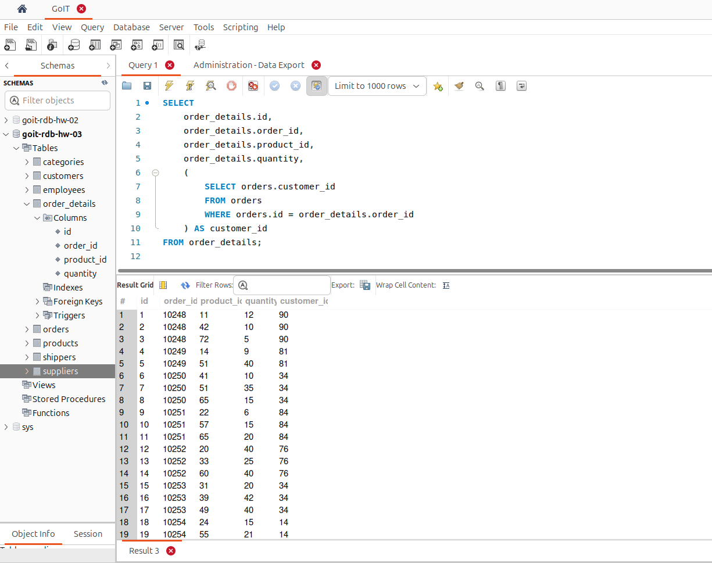
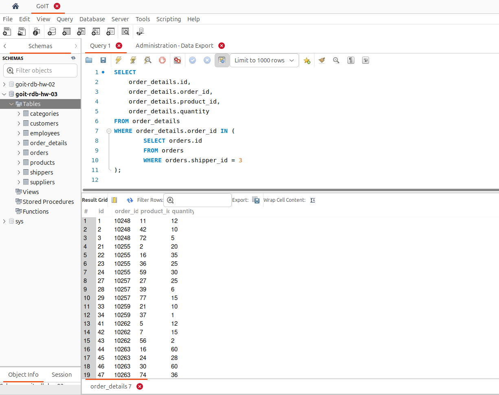
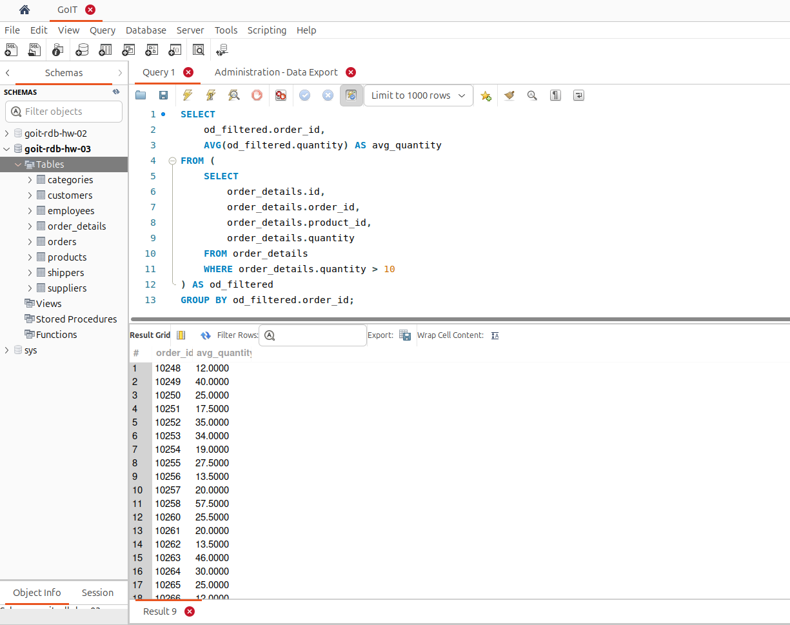
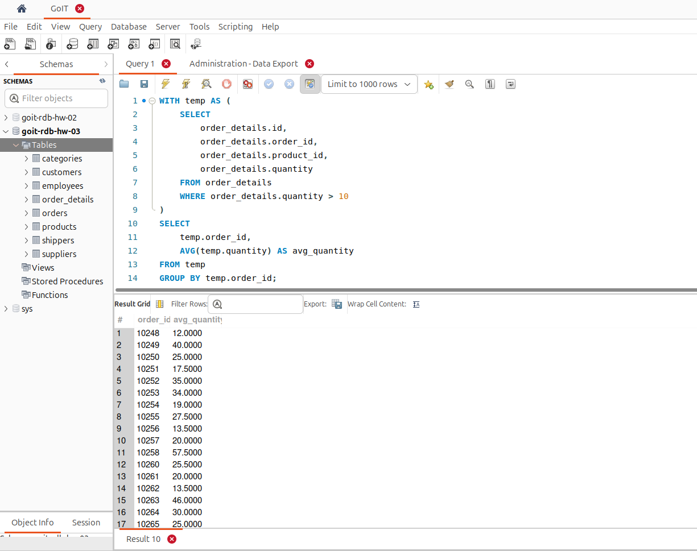
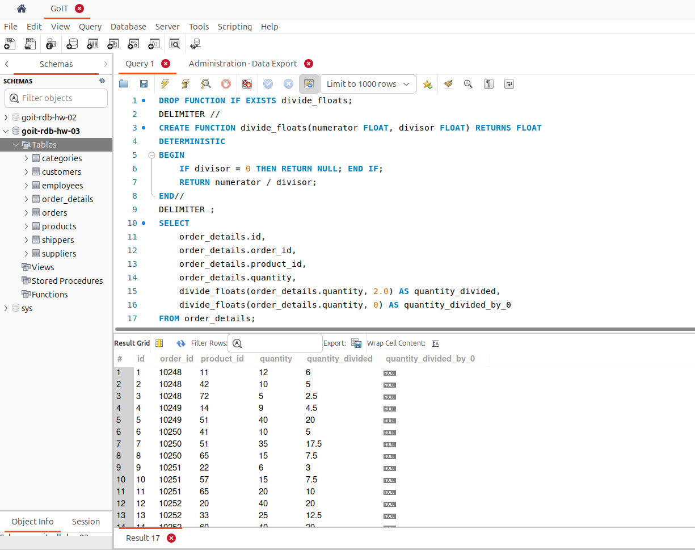

# [Домашнє завдання до Теми 5. Вкладені запити. Повторне використання коду](https://www.edu.goit.global/learn/25315460/21808779/22222325/homework)

## Вкладені запити

Вкладені запити (підзапити) в SQL — це запити, які включаються всередині інших запитів. Вкладені запити використовуються для отримання результатів, які потім використовуються в основному запиті. Це дозволяє створювати більш складні та гнучкі запити.

## Опис домашнього завдання

1. Напишіть SQL запит, який буде відображати таблицю `order_details` та поле `customer_id` з таблиці `orders` відповідно для кожного поля запису з таблиці `order_details`.
Це має бути зроблено за допомогою вкладеного запиту в операторі `SELECT`.

2. Напишіть SQL запит, який буде відображати таблицю `order_details`. Відфільтруйте результати так, щоб відповідний запис із таблиці `orders` виконував умову `shipper_id=3`.
Це має бути зроблено за допомогою вкладеного запиту в операторі `WHERE`.

3. Напишіть SQL запит, вкладений в операторі `FROM`, який буде обирати рядки з умовою `quantity>10` з таблиці `order_details`. Для отриманих даних знайдіть середнє значення поля `quantity` — групувати слід за `order_id`.

4. Розв’яжіть завдання 3, використовуючи оператор `WITH` для створення тимчасової таблиці `temp`. Якщо ваша версія MySQL більш рання, ніж 8.0, створіть цей запит за аналогією до того, як це зроблено в конспекті.

5. Створіть функцію з двома параметрами, яка буде ділити перший параметр на другий. Обидва параметри та значення, що повертається, повинні мати тип `FLOAT`.
Використайте конструкцію `DROP FUNCTION IF EXISTS`. Застосуйте функцію до атрибута quantity таблиці `order_details`. Другим параметром може бути довільне число на ваш розсуд.

### Критерії прийняття

1. Прикріплені посилання на репозиторій `goit-rdb-hw-05` та безпосередньо самі файли репозиторію архівом.
2. Написано всі 5 SQL запитів відповідно до заданих умов виконання. Запити виконуються й дають очікуваний результат.

## Рішення

### 1. Напишіть SQL запит, який буде відображати таблицю `order_details` та поле `customer_id` з таблиці `orders` відповідно для кожного поля запису з таблиці `order_details`. Це має бути зроблено за допомогою вкладеного запиту в операторі `SELECT`.

```sql
SELECT
    order_details.id,
    order_details.order_id,
    order_details.product_id,
    order_details.quantity,
    (
        SELECT orders.customer_id
        FROM orders
        WHERE orders.id = order_details.order_id
    ) AS customer_id
FROM order_details;

```


### 2. Напишіть SQL запит, який буде відображати таблицю `order_details`. Відфільтруйте результати так, щоб відповідний запис із таблиці `orders` виконував умову `shipper_id=3`. Це має бути зроблено за допомогою вкладеного запиту в операторі `WHERE`.

```sql
SELECT
    order_details.id,
    order_details.order_id,
    order_details.product_id,
    order_details.quantity
FROM order_details
WHERE order_details.order_id IN (
        SELECT orders.id
        FROM orders
        WHERE orders.shipper_id = 3
);
```



### 3. Напишіть SQL запит, вкладений в операторі `FROM`, який буде обирати рядки з умовою `quantity>10` з таблиці `order_details`. Для отриманих даних знайдіть середнє значення поля `quantity` — групувати слід за `order_id`.

```sql
SELECT
    od_filtered.order_id,
    AVG(od_filtered.quantity) AS avg_quantity
FROM (
    SELECT
        order_details.id,
        order_details.order_id,
        order_details.product_id,
        order_details.quantity
    FROM order_details
    WHERE order_details.quantity > 10
) AS od_filtered
GROUP BY od_filtered.order_id;
```




### 4. Розв’яжіть завдання 3, використовуючи оператор `WITH` для створення тимчасової таблиці `temp`.

```sql
WITH temp AS (
    SELECT
        order_details.id,
        order_details.order_id,
        order_details.product_id,
        order_details.quantity
    FROM order_details
    WHERE order_details.quantity > 10
)
SELECT
    temp.order_id,
    AVG(temp.quantity) AS avg_quantity
FROM temp
GROUP BY temp.order_id;
```



### 5. Створіть функцію з двома параметрами, яка буде ділити перший параметр на другий. Обидва параметри та значення, що повертається, повинні мати тип `FLOAT`. Використайте конструкцію `DROP FUNCTION IF EXISTS`. Застосуйте функцію до атрибута quantity таблиці `order_details`. Другим параметром може бути довільне число на ваш розсуд.

```sql
DROP FUNCTION IF EXISTS divide_floats;
DELIMITER //
CREATE FUNCTION divide_floats(numerator FLOAT, divisor FLOAT) RETURNS FLOAT
DETERMINISTIC
BEGIN
    IF divisor = 0 THEN RETURN NULL; END IF;
    RETURN numerator / divisor;
END//
DELIMITER ;
SELECT
    order_details.id,
    order_details.order_id,
    order_details.product_id,
    order_details.quantity,
    divide_floats(order_details.quantity, 2.0) AS quantity_divided,
    divide_floats(order_details.quantity, 0) AS quantity_divided_by_0
FROM order_details;
```




### Репозиторій
[goit-rdb-hw-05](https://github.com/nickolas-z/goit-rdb-hw-05)
